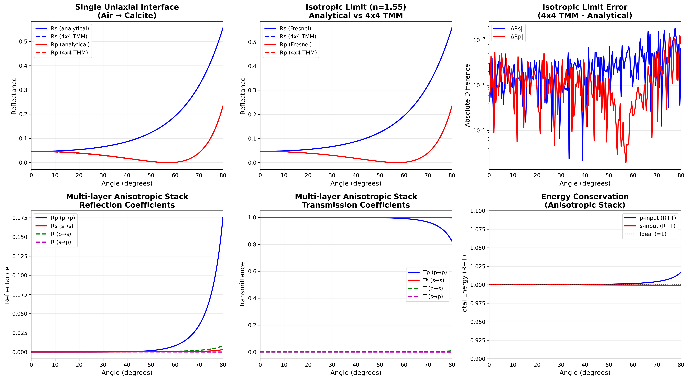

# DiffTMM: Differentiable Transfer Matrix Method

A PyTorch-based differentiable thin film solver for multi-layer optical coatings. Supports both isotropic and anisotropic materials with full autograd for inverse design.

## Advantages over NumPy TMM

| Feature | NumPy TMM ([sbyrnes321/tmm](https://github.com/sbyrnes321/tmm)) | DiffTMM |
|---------|------------------------------------------------------------------|---------|
| Differentiable | No | Yes (PyTorch autograd) |
| GPU acceleration | No (CPU only) | Yes (CUDA) |
| Batch processing | No (sequential) | Yes (vectorized) |
| Anisotropic materials | No (isotropic only) | Yes (4x4 transfer matrix) |
| Speed (batch=16) | 1x baseline | **~200x** (isotropic 2x2) |

## Installation

```bash
git clone https://github.com/singer-yang/DiffTMM.git
cd DiffTMM
pip install torch numpy matplotlib scipy
```

## Quick Start

### Forward Simulation (`1_forward_simu.py`)

Initialize a film stack with known refractive indices and thicknesses, then compute Fresnel coefficients at arbitrary wavelengths and angles.

```python
import torch
from film_solver_isotropic import IsotropicFilmSolver

# Define film stack: Glass | Ta2O5 | SiO2 | Ta2O5 | Glass
solver = IsotropicFilmSolver(
    n_in=1.5,                         # incident medium
    n_out=1.5,                        # exit medium
    n_layers_list=[2.10, 1.46, 2.10], # interior layer indices
    d_layers=[0.080, 0.120, 0.080],   # thicknesses in um
    device=torch.device("cuda"),
)

# Compute Fresnel coefficients: ts, tp, rs, rp
angles = torch.linspace(0, 1.2, 100, device=solver.device)
ts, tp, rs, rp = solver.simulate(theta=angles, wvln=[0.45, 0.55, 0.65])
# Output shape: (n_mirrors, n_wvlns, n_angles)
```

### Inverse Design via Differentiable Optimization (`2_inverse_design.py`)

Given target Fresnel coefficients, recover unknown film thicknesses using gradient-based optimization.

```python
import torch
from film_solver_isotropic import create_jones_matrix_isotropic

# Film stack with unknown thicknesses
n_list = torch.tensor([2.10, 1.46, 2.10, 1.46, 2.10], device="cuda")
d_param = torch.nn.Parameter(torch.randn(5, device="cuda") * 0.5)

def param_to_thickness(p):
    return torch.sigmoid(p) * 0.19 + 0.01  # map to [0.01, 0.20] um

# Optimization loop
optimizer = torch.optim.Adam([d_param], lr=0.02)
for step in range(3000):
    optimizer.zero_grad()
    d = param_to_thickness(d_param)
    pred = forward_tmm(n_list, d, n_in=1.0, n_out=1.52, inp=inp)
    loss = ((pred - target).real ** 2 + (pred - target).imag ** 2).mean()
    loss.backward()
    optimizer.step()
```

**Result**: Layer thicknesses recovered from random initialization:

```
Layer     GT (nm)   Recovered (nm)    Error (nm)
  1        60.00           60.00          0.00
  2       130.00          130.00          0.00
  3        85.00           85.00          0.00
  4       110.00          110.00          0.00
  5        70.00           70.00          0.00
```

## Two Solvers

- **`film_solver_isotropic.py`** — Fast 2x2 transfer matrix method for isotropic materials (~200x faster than NumPy TMM)
- **`film_solver_anisotropic.py`** — General 4x4 transfer matrix method for both isotropic and anisotropic materials

Both solvers share the same API:

```python
solver = Solver(
    n_in=1.0,                  # incident medium refractive index
    n_out=1.52,                # exit medium refractive index
    n_layers_list=[2.1, 1.46], # interior layer refractive indices
    d_layers=[0.08, 0.12],     # thicknesses in um (optional, random if None)
    device=torch.device("cuda"),
)
ts, tp, rs, rp = solver.simulate(theta, wvln)
```

## Accuracy Validation

Validated against the reference NumPy TMM library ([sbyrnes321/tmm](https://github.com/sbyrnes321/tmm)) on surface plasmon resonance (SPR) calculations:


The anisotropic 4x4 solver is validated for energy conservation, isotropic limit accuracy, cross-polarization coupling, and reciprocity:



## Performance Benchmarks

### Speed (batch=16, NVIDIA A100)


| Layers | TMM NumPy (s) | Anisotropic 4x4 (s) | Isotropic 2x2 (s) | Speedup (4x4) | Speedup (2x2) |
|--------|---------------|----------------------|--------------------|---------------|---------------|
| 3      | 0.389         | 0.043                | 0.002              | 9.1x          | 250.6x        |
| 11     | 0.782         | 0.135                | 0.004              | 5.8x          | 192.3x        |
| 25     | 1.463         | 0.291                | 0.008              | 5.0x          | 194.7x        |
| 39     | 2.145         | 0.455                | 0.011              | 4.7x          | 197.2x        |

### GPU Memory (batch=16, forward + backward)


The isotropic 2x2 solver uses ~5x less GPU memory than the anisotropic 4x4 solver. NumPy TMM is CPU-only (0 GPU memory).

## Repository Structure

```
├── film_solver_isotropic.py        # 2x2 isotropic solver (fast)
├── film_solver_anisotropic.py      # 4x4 anisotropic solver (general)
├── 1_forward_simu.py               # Example: forward simulation
├── 2_inverse_design.py             # Example: differentiable inverse design
├── tmm_numpy/                      # Reference NumPy TMM library (isotropic only)
│   ├── tmm_core.py                 #   Steven Byrnes' TMM implementation
│   └── manual.pdf                  #   Physics reference
├── benchmarks/                     # Accuracy and performance benchmarks
│   ├── 1_compare_angle_response_*.py
│   ├── 2_compare_speed.py
│   └── 3_compare_memory.py
└── README.md
```

## Physics

- **2x2 transfer matrix method**: Standard formulation for isotropic multi-layer films
- **4x4 transfer matrix method**: General formulation for anisotropic (birefringent) media
- Snell's law, Fresnel equations, evanescent wave handling beyond critical angle
- Bidirectional propagation (forward and reverse through the film stack)
- Complete polarization handling via Jones calculus

## References

- S. J. Byrnes, "Multilayer optical calculations," [arXiv:1603.02720](https://arxiv.org/abs/1603.02720)
- Steven Byrnes' TMM library: [github.com/sbyrnes321/tmm](https://github.com/sbyrnes321/tmm)
- Yang, X., Liu, Z., Nie, Z., Fan, Q., Shi, Z., Bonar, J., & Heidrich, W. (2026). "End-to-end differentiable design of geometric waveguide displays." *arXiv preprint* [arXiv:2601.04370](https://arxiv.org/abs/2601.04370)

## License

DiffTMM is licensed under the [Apache License 2.0](LICENSE).

The bundled NumPy TMM reference library (`tmm_numpy/`) is by Steven Byrnes and is licensed under the [MIT License](tmm_numpy/LICENSE.txt).
